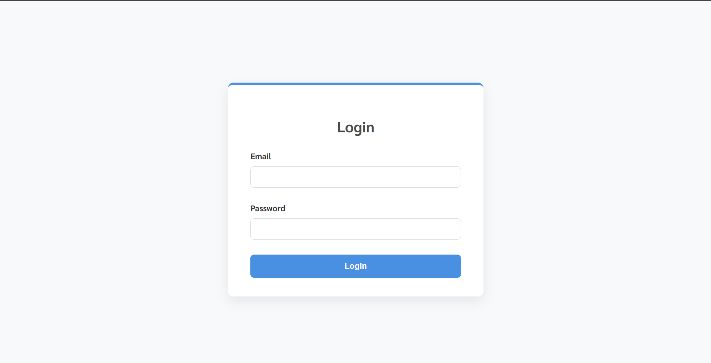
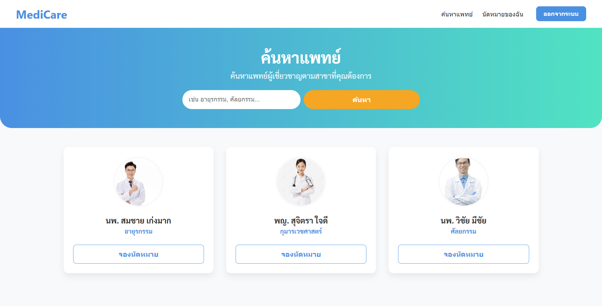
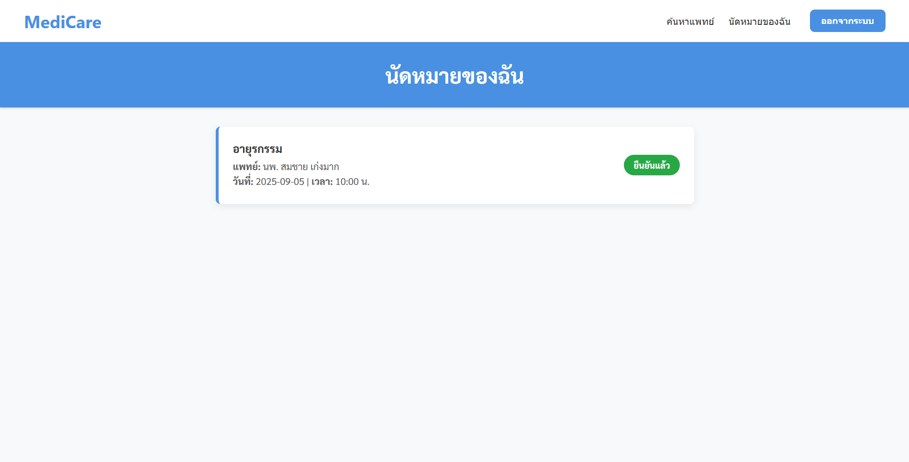

# โปรเจกต์เว็บแอปพลิเคชันสำหรับค้นหาและนัดหมายแพทย์ (Telemedicine SPA) สร้างขึ้นเพื่อเป็นส่วนหนึ่งของแบบทดสอบสำหรับตำแหน่ง Frontend Developer โดยพัฒนาตามโจทย์จากบริษัท MediCare 

## ✨ ฟีเจอร์หลัก (Features)

* **Mock Authentication:** เข้าสู่ระบบ / ออกจากระบบ โดยใช้ Token จำลองที่เก็บใน `localStorage`
* **ค้นหาแพทย์:** ค้นหาแพทย์ตามสาขาที่ต้องการ 
* **จัดการนัดหมาย:**
    * ดูรายการนัดหมายทั้งหมดของตนเอง
    * จองนัดหมายใหม่กับแพทย์ที่เลือก พร้อมเลือกวันและเวลา
* **State Management:** จัดการสถานะ Loading และ Error ขณะดึงข้อมูล
* **Form Validation:** ป้องกันการเลือกวันที่ผ่านมาแล้ว และการส่งฟอร์มที่ข้อมูลไม่ครบ
* **Responsive Design:** รองรับการใช้งานบนหน้าจอเดสก์ท็อปและมือถือ

## 📸 ภาพหน้าจอ (Screenshots)

| หน้า Login | หน้าค้นหาแพทย์ |
| :---: | :---: |
|  |  |
| **หน้านัดหมายของฉัน** | **หน้าฟอร์มจองนัด** |
|  |  |

## 🛠️ เทคโนโลยีที่ใช้ (Tech Stack)

* **Frontend:** [React.js](https://reactjs.org/)
* **UI Library:** Custom CSS
* **Routing:** [React Router DOM](https://reactrouter.com/)
* **Mock API:** [Mock Service Worker (MSW)](https://mswjs.io/)
* **Date & Time Picker:** [React Datepicker](https://reactdatepicker.com/)

---

## 🚀 การติดตั้งและรันโปรเจกต์ (Getting Started)

### สิ่งที่ต้องมี (Prerequisites)
* [Node.js](https://nodejs.org/) (เวอร์ชัน 16 หรือสูงกว่า)
* npm หรือ yarn

### ขั้นตอนการติดตั้ง
1.  **Clone a repository**
    ```bash
    git clone (https://github.com/Aom-666/exam-frontent) (https://github.com/Aom-666/exam-frontent)
    ```

2.  **เข้าไปที่โฟลเดอร์โปรเจกต์**
    ```bash
    cd exam-frontent
    ```

3.  **ติดตั้ง Dependencies ทั้งหมด**
    ```bash
    npm install
    ```

4.  **รันแอปพลิเคชัน**
    ```bash
    npm start
    ```
    แอปพลิเคชันจะเปิดขึ้นมาที่ `http://localhost:3000` โดยอัตโนมัติ

> **หมายเหตุ:** โปรเจกต์นี้ใช้ **Mock Service Worker (MSW)** ในการจำลอง API ดังนั้นจึง **ไม่จำเป็นต้องรันเซิร์ฟเวอร์แยกต่างหาก** แค่รัน `npm start` ก็สามารถใช้งานได้ครบทุกฟังก์ชันแล้ว

## 📜 สคริปต์ที่ใช้งานได้ (Available Scripts)

* **`npm start`**: รันแอปพลิเคชันในโหมดพัฒนา
* **`npm test`**: รันชุดทดสอบ
* **`npm run build`**: สร้างแอปพลิเคชันเวอร์ชันสำหรับนำไปใช้งานจริง (Production)
